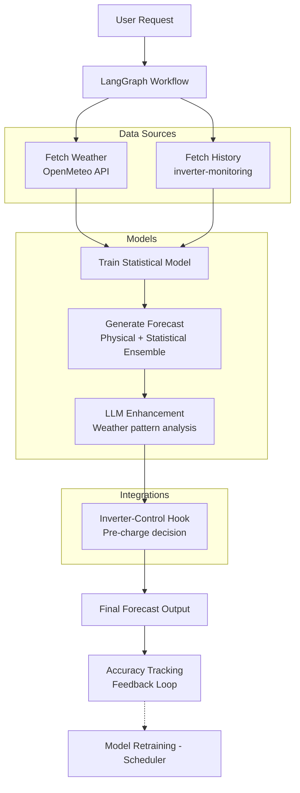
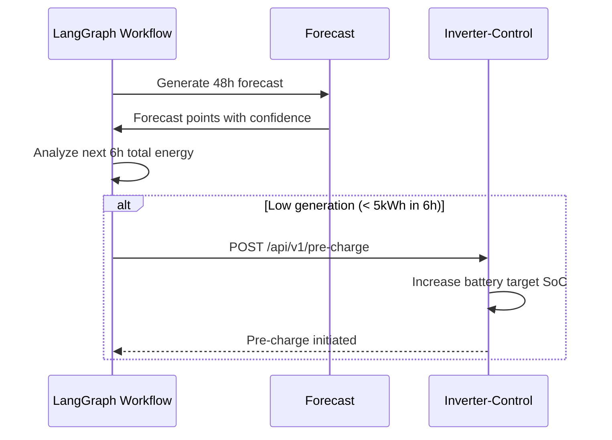
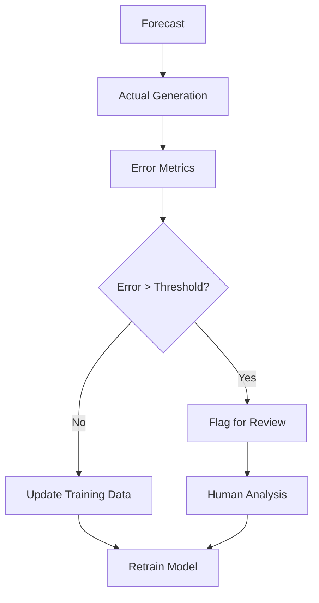

# Solar Forecast LangGraph

[](https://github.com/4alvit/solar-forecast-langgraph/actions/workflows/ci.yml)
[](https://codecov.io/gh/4alvit/solar-forecast-langgraph)
[](https://pypi.org/project/solar-forecast-langgraph/)
[](https://pypi.org/project/solar-forecast-langgraph/)
[](LICENSE)

LangGraph workflow for solar forecasting with:
- **Weather data agent** — OpenMeteo API (free, no key required)
- **Historical generation loader** — From inverter-monitoring webhook
- **Panel configuration schema** — Azimuth, tilt, capacity, losses
- **Forecast model** — Physical (clear-sky + clouds) + Statistical (ML) + LLM reasoning
- **Inverter-control integration** — Pre-charge battery before cloudy periods
- **Accuracy tracking** — Feedback loop for continuous improvement

---

## Architecture



---

## Installation

### From PyPI (recommended)

```bash
# Create and activate a virtual environment
python -m venv .venv
source .venv/bin/activate  # Windows: .venv\Scripts\activate

# Install from PyPI
pip install solar-forecast-langgraph
```

After installing, check the CLI is available:

```bash
solar-forecast --help
```

### From source (for development)

```bash
git clone git@github.com:4alvit/solar-forecast-langgraph.git
cd solar-forecast-langgraph
python -m venv .venv
source .venv/bin/activate
pip install -e ".[dev]"
pre-commit install
```

---

## Quick Start

```bash
# Copy example config and customize
cp site_config.example.py site_config.local.py
# Edit site_config.local.py with your panel details

# Run forecast (48h horizon, 30 days history)
solar-forecast --config site_config.local.py --horizon 48 --output forecast.json
```

Output example:
```
Forecast Summary:
  Site: my-solar-site
  Panel: south-roof
  Method: ensemble
  Horizon: 48 hours
  Total Energy: 42500 Wh
  Generated: 2024-01-15T10:30:00+00:00

Next 12 hours:
  2024-01-15 11:00: 1200W (1200Wh) [960-1440]
  2024-01-15 12:00: 2800W (2800Wh) [2240-3360]
  2024-01-15 13:00: 3500W (3500Wh) [2800-4200]
```

---

## Configuration

### Panel Configuration

```python
from solar_forecast.config import PanelConfig, SiteConfig

panel = PanelConfig(
    name="South Roof",
    panel_id="south-roof",
    azimuth=180,  # 0=N, 90=E, 180=S, 270=W
    tilt=35,  # Degrees from horizontal
    capacity_kw=5.0,  # DC capacity
    module_count=14,
    latitude=52.37,
    longitude=4.90,
    # Optional losses
    shading_loss=0.0,
    soiling_loss=0.02,
    wiring_loss=0.01,
    module_efficiency=0.20,
    temperature_coefficient=-0.0035,
    inverter_efficiency=0.96,
    dc_ac_ratio=1.2,
)

site = SiteConfig(
    site_name="my-site",
    latitude=52.37,
    longitude=4.90,
    timezone="Europe/Amsterdam",
    panels=[panel],
)
```

See [site_config.example.py](site_config.example.py) for full example.

---

## Forecast Methods

| Method | Description | Use Case |
|--------|-------------|----------|
| `physical` | Clear-sky model + cloud adjustment | No historical data |
| `statistical` | ML model on historical data | Sufficient history (30+ days) |
| `ensemble` | Weighted: 60% physical + 40% statistical | **Default, best accuracy** |
| `llm_enhanced` | LLM analyzes weather patterns | Future: complex weather |

---

## Inverter-Control Integration

The workflow includes a hook for **pre-charging batteries** before forecasted cloudy periods:



Enable in config:
```python
# In site_config.local.py
INVERTER_CONTROL_URL = "http://inverter-control:8081"
INVERTER_CONTROL_API_KEY = "your-key"
```

---

## Accuracy Tracking

Feedback loop for continuous improvement:



Metrics tracked per panel:
- **MAE** (Mean Absolute Error)
- **RMSE** (Root Mean Square Error)
- **MAPE** (Mean Absolute Percentage Error)
- **Bias** (Systematic over/under prediction)

---

## Development

### Run Tests

```bash
pytest tests/ -v --cov=solar_forecast
```

### Lint & Format

```bash
ruff check .
ruff format .
```

### Type Check

```bash
mypy solar_forecast/
```

---

## Project Structure

```
solar-forecast-langgraph/
├── solar_forecast/
│   ├── __init__.py          # Public exports
│   ├── config.py            # Panel/Site configuration schemas
│   ├── weather.py           # OpenMeteo client
│   ├── history.py           # Historical data loaders
│   ├── model.py             # Physical/Statistical/LLM models
│   ├── workflow.py          # LangGraph workflow
│   └── main.py              # CLI entry point
├── tests/
│   ├── test_config.py
│   ├── test_weather.py
│   ├── test_model.py
│   └── test_workflow.py
├── .github/workflows/ci.yml # CI/CD pipeline
├── pyproject.toml           # Package config
├── site_config.example.py   # Example configuration
└── README.md
```

---

## Roadmap

- [ ] LLM-enhanced forecasting (weather pattern analysis)
- [ ] Automated model retraining scheduler
- [ ] Prometheus metrics export
- [ ] Grafana dashboard template
- [ ] Multi-site support in single workflow
- [ ] Battery SoC optimization (not just pre-charge)
- [ ] Shadow modeling from 3D terrain

---

## Related Projects

- **[inverter-monitoring](https://github.com/4alvit/inverter-monitoring)** — Generation data webhook
- **[inverter-control](https://github.com/4alvit/inverter-control)** — Grid-zero feed-in control

---

## License

MIT License — see [LICENSE](LICENSE) for details.